# Software Development Lifecycle - TeamLifecycle Workflow

## Complete SDLC Flow with Roles

```mermaid
graph TB
    Start([User Requirements]) --> PM[/"@PM<br/>Project Manager<br/>Planning & Scope"/]
    
    PM --> PlanDoc["📄 Project Plan v1<br/>docs/sprints/sprint-N/plans/"]
    PlanDoc --> Approval1{User Approval?}
    
    Approval1 -->|Rejected| PM
    Approval1 -->|Approved| DesignPhase["Design Phase"]
    
    DesignPhase --> SA[/"@SA<br/>System Analyst<br/>Architecture & APIs"/]
    DesignPhase --> UIUX[/"@UIUX<br/>UI/UX Designer<br/>Interface Design"/]
    DesignPhase --> PO[/"@PO<br/>Product Owner<br/>Backlog & Stories"/]
    
    SA --> ArchDoc["📐 Architecture Spec<br/>docs/sprints/sprint-N/designs/"]
    UIUX --> UIDoc["🎨 UI/UX Spec<br/>docs/sprints/sprint-N/designs/"]
    PO --> BacklogDoc["📋 Product Backlog<br/>docs/sprints/sprint-N/plans/"]
    
    ArchDoc --> ReviewPhase["Review Phase"]
    UIDoc --> ReviewPhase
    BacklogDoc --> ReviewPhase
    
    ReviewPhase --> QA[/"@QA<br/>Quality Assurance<br/>Design Verification"/]
    ReviewPhase --> SECA[/"@SECA<br/>Security Analyst<br/>Security Review"/]
    
    QA --> QAReport["✅ QA Report<br/>docs/sprints/sprint-N/reviews/"]
    SECA --> SecReport["🔒 Security Report<br/>docs/sprints/sprint-N/reviews/"]
    
    QAReport --> Approval2{Design Approved?}
    SecReport --> Approval2
    
    Approval2 -->|Issues Found| DesignPhase
    Approval2 -->|Approved| DevPhase["Development Phase"]
    
    DevPhase --> DEV[/"@DEV<br/>Developer<br/>Implementation"/]
    DevPhase --> DEVOPS[/"@DEVOPS<br/>DevOps Engineer<br/>Infrastructure"/]
    
    DEV --> Code["💻 Source Code<br/>+ Dev Log<br/>docs/sprints/sprint-N/logs/"]
    DEVOPS --> Infra["🏗️ Infrastructure<br/>+ DevOps Log<br/>docs/sprints/sprint-N/logs/"]
    
    Code --> TestPhase["Testing Phase"]
    Infra --> TestPhase
    
    TestPhase --> TESTER[/"@TESTER<br/>Tester<br/>Functional & E2E Testing"/]
    
    TESTER --> TestReport["🧪 Test Report<br/>docs/sprints/sprint-N/tests/"]
    
    TestReport --> BugCheck{Bugs Found?}
    
    BugCheck -->|Critical/High| BugFix["🐛 Bug Fixing"]
    BugFix --> DEV
    
    BugCheck -->|None/Low| Deploy["Deployment"]
    
    Deploy --> DEVOPS
    DEVOPS --> Staging["📦 Staging Environment"]
    Staging --> Production["🚀 Production Environment"]
    
    Production --> REPORTER[/"@REPORTER<br/>Reporter<br/>Documentation"/]
    
    REPORTER --> FinalReport["📊 Final Report<br/>docs/sprints/sprint-N/reports/"]
    
    FinalReport --> STAKEHOLDER[/"@STAKEHOLDER<br/>Stakeholder<br/>Final Review"/]
    
    STAKEHOLDER --> Approval3{Final Approval?}
    
    Approval3 -->|Rejected| PM
    Approval3 -->|Approved| Complete([✨ Project Complete])
    
    style Start fill:#e1f5e1,stroke:#2e7d32,stroke-width:3px,color:#000
    style Complete fill:#e1f5e1,stroke:#2e7d32,stroke-width:3px,color:#000
    style PM fill:#fff4e6,stroke:#e65100,stroke-width:2px,color:#000
    style SA fill:#e3f2fd,stroke:#0277bd,stroke-width:2px,color:#000
    style UIUX fill:#f3e5f5,stroke:#6a1b9a,stroke-width:2px,color:#000
    style PO fill:#fff4e6,stroke:#e65100,stroke-width:2px,color:#000
    style QA fill:#e8f5e9,stroke:#2e7d32,stroke-width:2px,color:#000
    style SECA fill:#ffebee,stroke:#c62828,stroke-width:2px,color:#000
    style DEV fill:#e1f5fe,stroke:#01579b,stroke-width:2px,color:#000
    style DEVOPS fill:#fce4ec,stroke:#ad1457,stroke-width:2px,color:#000
    style TESTER fill:#f1f8e9,stroke:#558b2f,stroke-width:2px,color:#000
    style REPORTER fill:#fff3e0,stroke:#ef6c00,stroke-width:2px,color:#000
    style STAKEHOLDER fill:#e0f2f1,stroke:#00695c,stroke-width:2px,color:#000
    style Approval1 fill:#fff9c4,stroke:#f57f17,stroke-width:2px,color:#000
    style Approval2 fill:#fff9c4,stroke:#f57f17,stroke-width:2px,color:#000
    style Approval3 fill:#fff9c4,stroke:#f57f17,stroke-width:2px,color:#000
    style BugCheck fill:#ffccbc,stroke:#d84315,stroke-width:2px,color:#000
```

## Parallel Execution Phases

## Enhanced Workflows

```mermaid
graph TB
    User([User Request]) --> Route{"/route<br/>Workflow Selection"}
    
    Route -->|"Small Task<br/>< 4 hours"| Cycle["/cycle<br/>Complete Task Lifecycle"]
    Route -->|"Complex Feature<br/>Investigation"| Explore["/explore<br/>Deep Investigation"]
    Route -->|"Large Project<br/>Multi-Sprint"| Specs["/specs<br/>Specification"]
    Route -->|"Production Issue"| Emergency["/emergency<br/>Critical Response"]
    Route -->|"Maintenance"| Housekeeping["/housekeeping<br/>Cleanup"]
    
    Cycle --> Plan["📝 Plan"]
    Plan --> Work["⚙️ Work"]
    Work --> Review["✅ Review"]
    Review --> Compound["📚 Compound Knowledge"]
    
    Explore --> Analysis["🔍 Multi-Order Analysis"]
    Analysis --> Research["📖 Research"]
    Research --> Recommendations["💡 Recommendations"]
    
    Specs --> Requirements["📋 Requirements"]
    Requirements --> Design["🎨 Design"]
    Design --> Tasks["✅ Task Breakdown"]
    
    Emergency --> Assess["🚨 Assess Impact"]
    Assess --> Hotfix["🔧 Hotfix"]
    Hotfix --> Deploy["🚀 Deploy"]
    Deploy --> Postmortem["📝 Postmortem"]
    Postmortem --> Compound
    
    Housekeeping --> Archive["📦 Archive"]
    Archive --> FixDrift["🔄 Fix Drift"]
    FixDrift --> UpdateIndex["📇 Update Index"]
    
    Compound --> KB[("Knowledge Base<br/>.agent/knowledge-base/")]
    Recommendations --> KB
    Tasks --> StandardSDLC["Standard SDLC Flow"]
    UpdateIndex --> Complete([Complete])
    
    style User fill:#e1f5e1,stroke:#2e7d32,stroke-width:3px,color:#000
    style Complete fill:#e1f5e1,stroke:#2e7d32,stroke-width:3px,color:#000
    style Route fill:#fff9c4,stroke:#f57f17,stroke-width:2px,color:#000
    style KB fill:#e1bee7,stroke:#6a1b9a,stroke-width:3px,color:#000
    style Compound fill:#c5e1a5,stroke:#558b2f,stroke-width:2px,color:#000
```

## Compound Learning Loop

```mermaid
graph LR
    Problem["🐛 Problem<br/>Encountered"] --> Solution["💡 Solution<br/>Implemented"]
    Solution --> Document["📝 Document<br/>in KB"]
    Document --> Index["📇 Update<br/>INDEX.md"]
    Index --> Search["🔍 Search<br/>Before Next Task"]
    Search --> Reuse["♻️ Reuse<br/>Solution"]
    Reuse --> Compound["📈 Compound<br/>Knowledge"]
    Compound --> Faster["⚡ Faster<br/>Future Work"]
    Faster --> Problem
    
    style Problem fill:#ffccbc,stroke:#d84315,stroke-width:2px,color:#000
    style Solution fill:#c5e1a5,stroke:#558b2f,stroke-width:2px,color:#000
    style Document fill:#b3e5fc,stroke:#01579b,stroke-width:2px,color:#000
    style Index fill:#f0f4c3,stroke:#9e9d24,stroke-width:2px,color:#000
    style Search fill:#ffe0b2,stroke:#ef6c00,stroke-width:2px,color:#000
    style Reuse fill:#c5cae9,stroke:#4527a0,stroke-width:2px,color:#000
    style Compound fill:#e1bee7,stroke:#6a1b9a,stroke-width:2px,color:#000
    style Faster fill:#a5d6a7,stroke:#2e7d32,stroke-width:2px,color:#000
```

## Approval Gates

```mermaid
graph TB
    Gate1["🚪 Gate 1<br/>Project Plan Approval"]
    Gate2["🚪 Gate 2<br/>Design Approval"]
    Gate3["🚪 Gate 3<br/>Final Delivery Approval"]
    
    PM["@PM Creates Plan"] --> Gate1
    Gate1 -->|Approved| Design["Design Phase"]
    Gate1 -->|Rejected| PM
    
    Design --> Reviews["@QA + @SECA Review"]
    Reviews --> Gate2
    Gate2 -->|Approved| Development["Development Phase"]
    Gate2 -->|Rejected| Design
    
    Development --> Testing["Testing & Deployment"]
    Testing --> Report["@REPORTER Creates Report"]
    Report --> Stakeholder["@STAKEHOLDER Review"]
    Stakeholder --> Gate3
    Gate3 -->|Approved| Complete["✨ Complete"]
    Gate3 -->|Rejected| PM
    
    style Gate1 fill:#fff9c4,stroke:#f57f17,stroke-width:3px,color:#000
    style Gate2 fill:#fff9c4,stroke:#f57f17,stroke-width:3px,color:#000
    style Gate3 fill:#fff9c4,stroke:#f57f17,stroke-width:3px,color:#000
    style Complete fill:#e1f5e1,stroke:#2e7d32,stroke-width:3px,color:#000
```

## Legend

- **Rectangles** - Roles or Activities
- **Diamonds** - Decision Points
- **Cylinders** - Data Storage
- **Rounded Rectangles** - Start/End Points
- **Parallel Paths** - Independent concurrent work
- **Approval Gates** - User decision required

---

**Generated:** 2026-01-02
**Workflow:** TeamLifecycle with Compound Engineering
**Tool:** Mermaid.js Diagrams
